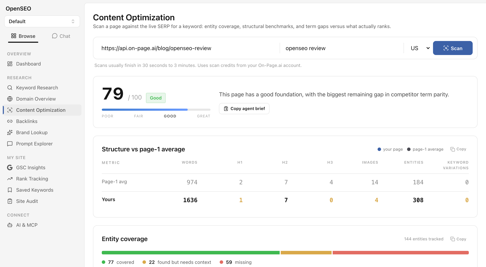

# OpenSEO

> [!NOTE]
> **This fork adds an optional Content Optimization module** on top of upstream
> [OpenSEO](https://github.com/every-app/open-seo): entity coverage, structure
> benchmarks, competitor term gaps, and content suggestions for any URL and
> keyword, scored against the live SERP. It runs through your own
> [On-Page.ai](https://api.on-page.ai) account (bring-your-own-key, like
> DataForSEO) and adds zero new npm dependencies. Without a connected account
> the module stays dormant, and it can be switched off entirely in Settings.
>
> **Quick start:** follow [Install this fork](#install-this-fork) below, then
> open **Content Optimization** in the sidebar and click **Connect your
> On-Page.ai account**. New accounts include free trial credits.
>
> Everything else is unchanged OpenSEO, kept current with
> [every-app/open-seo](https://github.com/every-app/open-seo).



## Install this fork

```bash
git clone https://github.com/lanpublications/open-seo.git
cd open-seo
cp .env.example .env   # add your DataForSEO key (see docs/DATAFORSEO_API_KEY.md)
docker build -f Dockerfile.selfhost -t open-seo:local .
OPEN_SEO_IMAGE=open-seo:local docker compose up -d
```

Then open `http://localhost:3001`, go to **Content Optimization** under
Research in the sidebar, and click **Connect your On-Page.ai account**. New
accounts include free trial credits, so your first scans cost nothing.

> [!IMPORTANT]
> Build the image locally as shown above. A plain `docker compose up -d` pulls
> the upstream prebuilt image, which does not include this module.

For other setups (Cloudflare, running from source), follow the upstream guides
below using this repo, and build from this source instead of pulling the
published image.

## Upgrading this fork

```bash
cd open-seo
git pull
docker build -f Dockerfile.selfhost -t open-seo:local .
OPEN_SEO_IMAGE=open-seo:local docker compose run --rm --entrypoint sh open-seo scripts/fork-upgrade.sh
OPEN_SEO_IMAGE=open-seo:local docker compose up -d
```

The `docker compose run` step keeps the upgrade from stopping on
`table content_scans already exists`. The module's database migration gets a
new number whenever upstream adds a migration of its own, and this step tells
an existing install that the module's tables are already in place. It is safe
to run on every upgrade.

> Open source alternative to Semrush and Ahrefs

OpenSEO is an SEO tool for _the people_. If tools like Semrush or Ahrefs are too expensive or bloated, OpenSEO is a pay-as-you-go alternative that you actually control.

> All-in-one SEO tool for you and your AI agent.

Connect with any agent like Claude Code, OpenClaw or Hermes. We have pre-built skills, but you can build your own to tailor OpenSEO to your needs.


## Hosted Version

Try OpenSEO for free on our website. If you want to support the project, a hosted subscription is $10/month.

[openseo.so](https://openseo.so)

## Why use OpenSEO?

- Best in class MCP and AI Skills.
- Modern, simple UI.
  - Focused workflows instead of a bloated, complex SEO suite.
- No subscriptions.
  - Bring your own DataForSEO API key and pay only for what you use.
- Fork and vibe code your own custom tool.

## Main SEO Workflows

- Keyword research
- Rank tracking
- Competitor Insights
- Backlinks
- Site Audits
- AI Visibility

## OpenSEO MCP & Agent Skills

OpenSEO exposes an MCP server so AI agents like Claude Code, OpenClaw, and Hermes can use your SEO data directly. Agent Skills are reusable workflows that guide your agent through SEO tasks using the MCP.

- [Set up OpenSEO MCP](https://openseo.so/docs/mcp)
- [Set up OpenSEO Agent Skills](https://openseo.so/docs/skills/setup)

## Self-Hosting

OpenSEO supports two self-hosting paths:

- **Simple: Docker (Best for testing it out)** - For personal use on your own machine. See [`docs/SELF_HOSTING_DOCKER.md`](./docs/SELF_HOSTING_DOCKER.md).
  - Unless you already are self-hosting other apps and are confident doing so, we recommend self-hosting with Cloudflare as opposed to Railway, Coolify or Dokploy.
  - We plan to make it simpler to host on those platforms in the next few months.
- **Recommended: Cloudflare** - For internet-facing self-hosting across multiple devices or with your team (works on the free plan). See [`docs/SELF_HOSTING_CLOUDFLARE.md`](./docs/SELF_HOSTING_CLOUDFLARE.md).

Either way, you need a DataForSEO API key to get SEO data. See [`docs/DATAFORSEO_API_KEY.md`](./docs/DATAFORSEO_API_KEY.md).

## Costs

OpenSEO needs a [DataForSEO](https://dataforseo.com/?aff=255379) API key so that you can get SEO data. You pay them directly when self hosting.

See [openseo.so/pricing](https://openseo.so/pricing)

When you self host, your costs will be slightly lower than the estimates on our website. The way the hosted service makes money is by charging 28% extra for every request we make to DataForSEO.

## Local Development

See [`docs/LOCAL_DEVELOPMENT.md`](./docs/LOCAL_DEVELOPMENT.md).

## Contributing

Creating clear issues is the best way to contribute.

Read more here: [`docs/CONTRIBUTING.md`](./docs/CONTRIBUTING.md)

We have this skill: `/simple-issue-description` which helps.

```sh
npx skills add every-app/open-seo --skill simple-issue-description
```

## Community

Join Discord to chat: [Discord](https://discord.gg/c9uGs3cFXr)

Follow along for updates:

- Follow on X: https://x.com/bensenescu
- Sign up for the mailing list on our website: [openseo.so](https://openseo.so)
